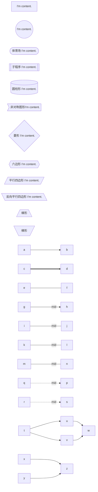
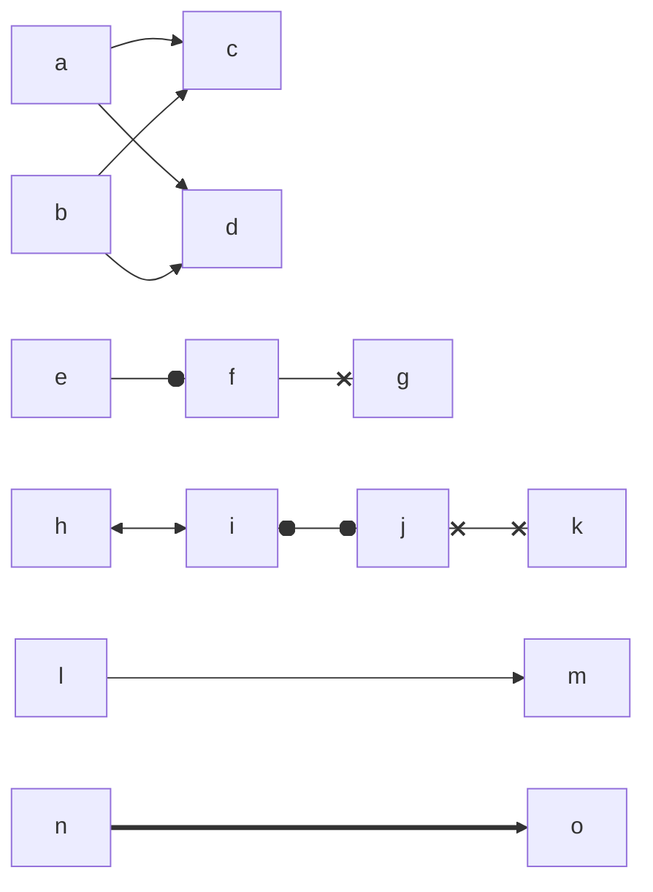
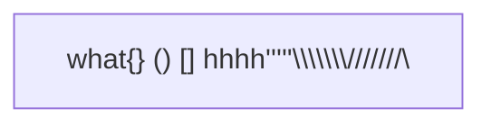
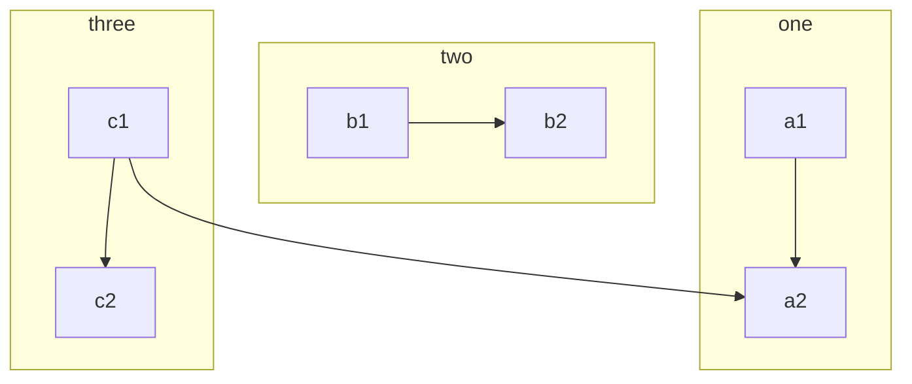
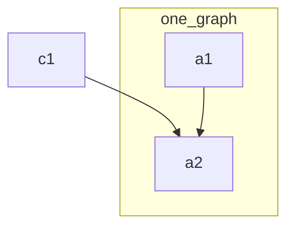
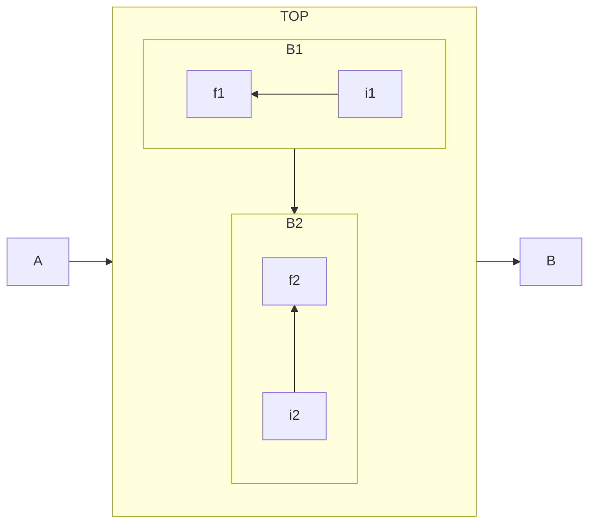
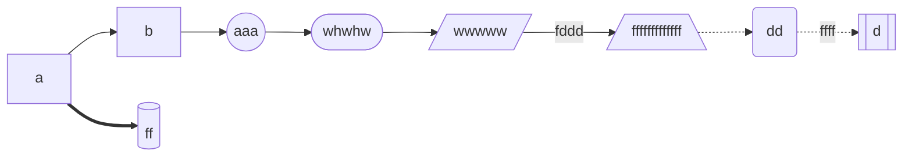

# flowchart

x & y --> z
&前后必须有空格
flowchart LR的ui显示效果更好更多

### 所有连接线

| Length            |    1   |    2    |     3    |
|-------------------|:------:|:-------:|:--------:|
| Normal            |  `---` |  `----` |  `-----` |
| Normal with arrow |  `-->` |  `--->` |  `---->` |
| Thick             |  `===` |  `====` |  `=====` |
| Thick with arrow  |  `==>` |  `===>` |  `====>` |
| Dotted            | `-.-`  | `-..-`  | `-...-`  |
| Dotted with arrow | `-.->` | `-..->` | `-...->` |

### 如果文字中要用到特殊字符，使用`""`包裹
例如

### 使用编码字符

### 多子图联动

### 外部指引

### 多图嵌套

